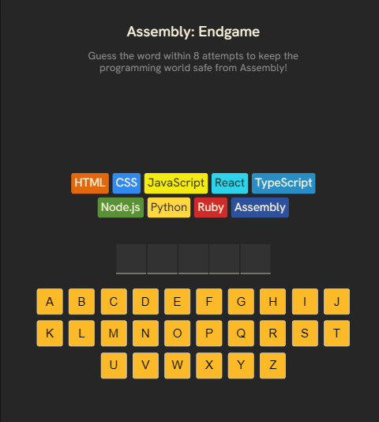

# 🕹️ Assembly Endgame

**Assembly Endgame** is a fast-paced word-guessing game where your mission is to **save the programming world** from being overrun by Assembly language! Can you guess the word before all other languages fall?



---

## 🚀 How to Play

You have **8 attempts** to guess a secret word one letter at a time. Each incorrect guess causes a modern programming language to fall. If all are gone, you lose — and Assembly takes over!

- ✅ Correct guesses reveal the letter in the word.
- ❌ Wrong guesses eliminate one programming language.
- 🎉 Win the game by guessing the full word before all languages are lost.
- 🔁 Restart anytime with a **New Game** button.

---

## 🎨 Features

- Interactive letter-based guessing with visual feedback
- "Lives" are themed as programming languages (Python, JavaScript, etc.)
- Visual effects like 🎊 confetti on win and 😭 messages on loss
- Accessible live-region status updates for screen readers
- Responsive keyboard UI with color-coded feedback

---

## 🛠️ Built With

- **React** – for building the interactive UI
- **clsx** – for conditional class handling
- **react-confetti** – for celebration effect
- Custom utility logic:
  - Random word selection
  - Farewell messages per eliminated language

---

## 📁 Project Structure

```
src/
├── App.tsx # Main game component
├── utils/
│ ├── languages.ts # List of programming languages with styles
│ └── utils.ts # Utility functions (e.g., word generator)
├── App.css # Styling for the game
```

---

## 🧪 Example Language Elimination

Each incorrect guess causes a language to fall:

```
[Python] [JavaScript] [Go] [Rust] [TypeScript] [Ruby] [Swift] [C++]
```

As the game progresses:

```
[Python ❌] [JavaScript ❌] [Go ❌] [Rust ❌] [TypeScript] [Ruby] [Swift] [C++]
```

---

## 🧠 Inspiration

A twist on classic Hangman, **Assembly Endgame** uses programming languages as "lives" to give the game a playful twist for developers and coding enthusiasts.

---

## 🏁 Getting Started

### Prerequisites

- Node.js
- npm or yarn

### Install & Run

```bash
git clone https://github.com/alfaqi/Assembly-Endgame.git
cd Assembly-Endgame
npm install
npm run dev
```

Then open http://localhost:3000 in your browser.

# 📌 TODO / Improvements

- Add difficulty levels (easy/medium/hard word lists)
- Track win/loss history
- Add animations for eliminated languages
- Improve mobile layout

# 📃 License

MIT — feel free to use and modify!

# 🙌 Acknowledgements

- Inspired by classic word games
- Designed for developers who love their languages — and fear Assembly 😅
